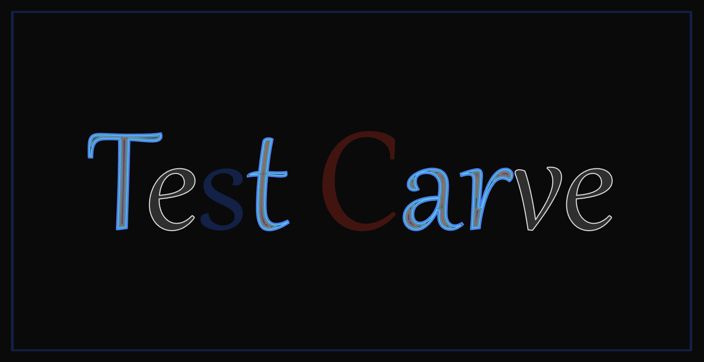
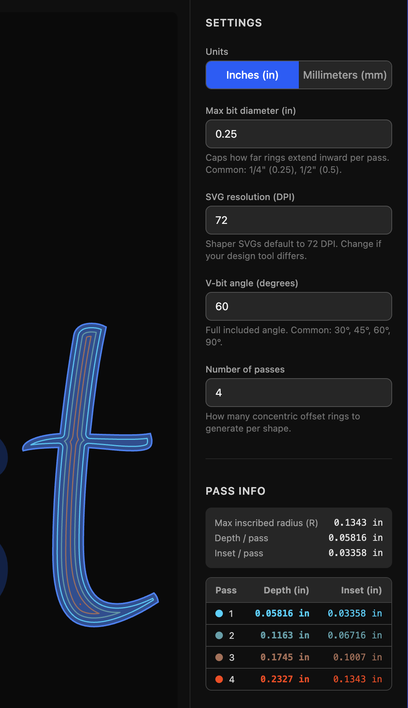
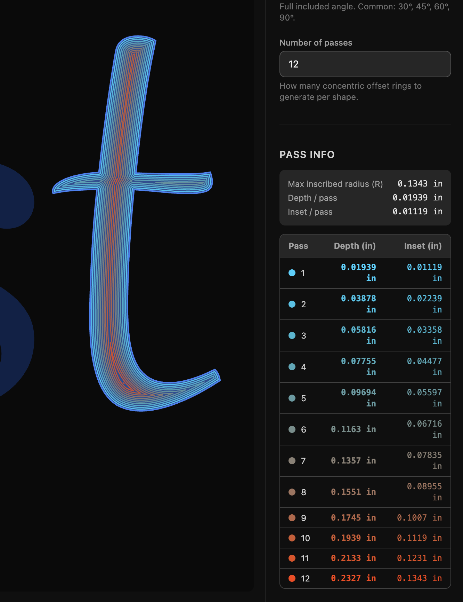

# Fake V-Carver

A browser-based SVG pre-processing tool for the [Shaper Origin](https://www.shapertools.com/) CNC router. Upload a design, select the paths you want to V-carve, configure your bit, and the tool generates a series of concentric inner-offset passes with the `shaper:cutDepth` attribute encoded on each path — ready to load directly into Shaper Origin.

## Screenshots

### Design preview

The dark-background design view shows all selected paths highlighted with pass-colored offset rings (cyan = shallow, orange/red = deep). Each path is processed independently based on its own geometry.



### Shaper color encoding preview

Toggle to Shaper preview mode to see exactly how the file will appear in the Shaper Origin cut encoding — selected paths become guide blue, offset rings are shown as online gray, and other Shaper color encodings (exterior black, anchor red, pocket gray) are preserved as-is.


### Settings panel and pass info

The settings sidebar controls units (in/mm), max bit diameter, SVG resolution (DPI), V-bit angle, and number of passes. The pass info table shows the exact depth and inset for each pass in the selected unit, color-coded to match the rings in the preview.



### Increased pass count

Increasing the number of passes spreads the V-bit geometry across more, shallower cuts. The preview updates live and the pass table expands to show all depths and insets. The more passes there are, the more accurate to V-carving the result will be.



## What it does

- Drag-and-drop or click to upload any SVG file
- Automatically detects Shaper Origin color encoding (exterior, interior, online, guide, anchor, pocket)
- Renders an interactive preview with scroll-to-zoom and drag-to-pan
- ⌘-click (macOS) or Ctrl-click (Windows/Linux) to select/deselect paths
- Computes inward offset rings using V-bit geometry: bit angle + max bit diameter drive the pass spacing
- Each shape independently computes its own pass depth based on its inscribed radius
- Live pass info table showing exact depth and inset per pass in your chosen unit
- Toggle between design preview (dark, pass-color-coded) and Shaper preview (white background, accurate Shaper color encoding)
- Exports a clean, indented SVG with grouped offset paths, correct `shaper:cutDepth` attributes, and source paths re-encoded as guide blue

## Tech stack

- React + TypeScript + Vite
- Tailwind CSS
- Clipper.js for polygon offset math

## Development

```bash
npm install
npm run dev
```

## About

This project was mostly generated using [Claude](https://claude.ai) (claude-sonnet-4-6) via [OpenCode](https://opencode.ai). The implementation was built iteratively through conversation, covering SVG parsing, V-bit geometry math, Clipper.js offset pipeline, pan/zoom canvas, and Shaper Origin color encoding support.
